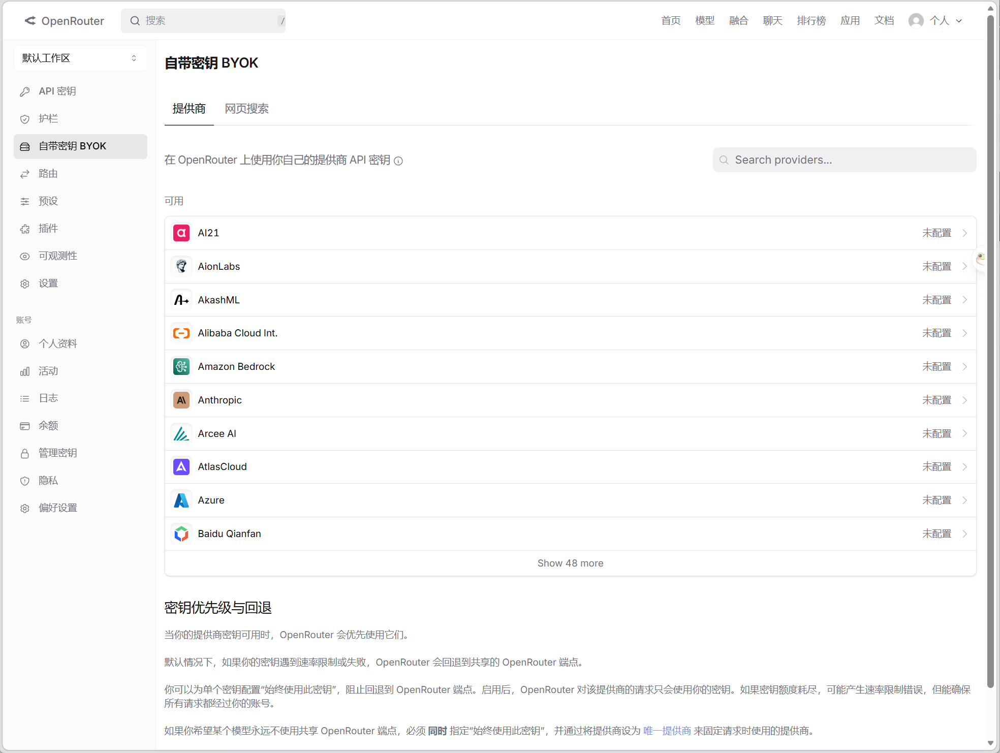
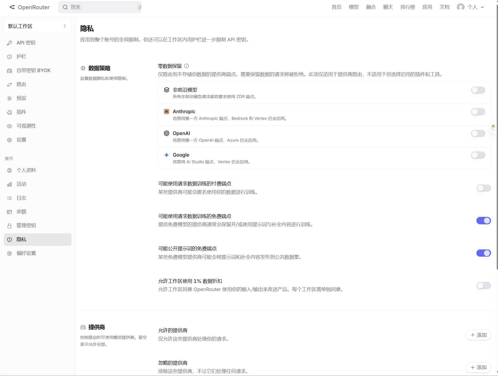
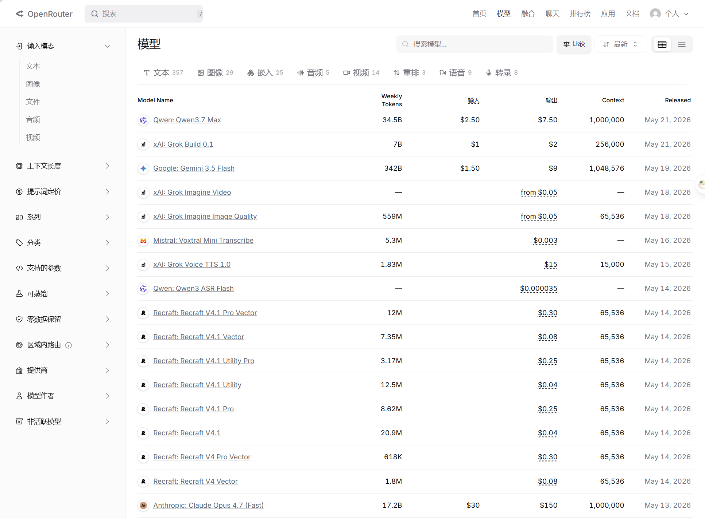
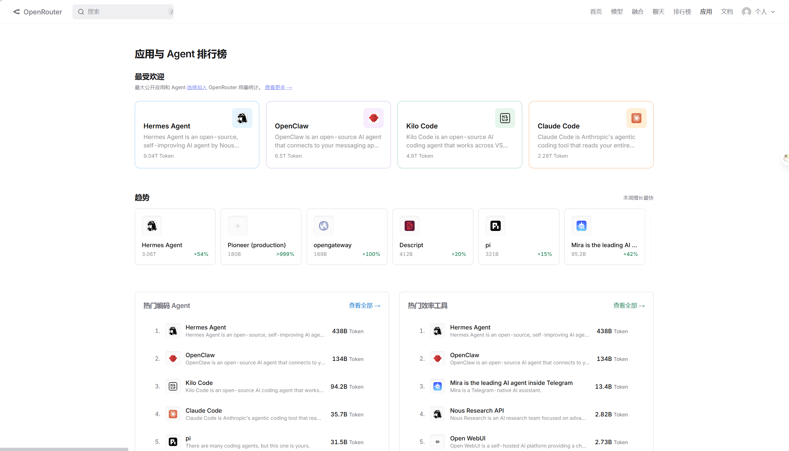
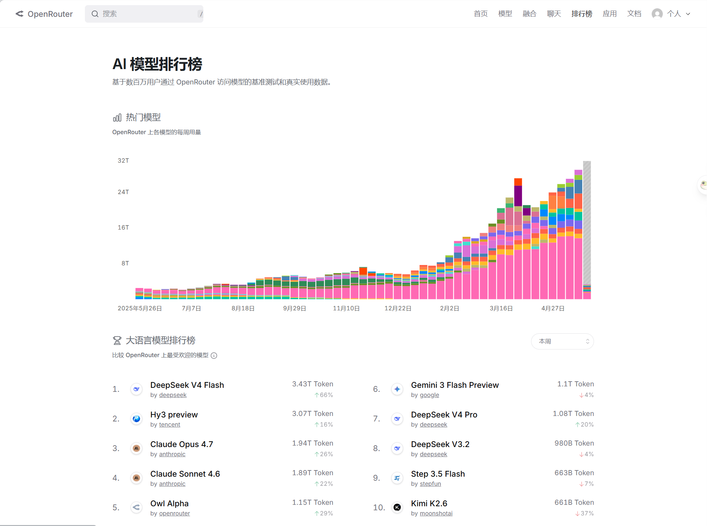

<!-- badges -->
[](LICENSE)
[](https://www.tampermonkey.net/)

# OpenRouter Workspaces 中文

OpenRouter 工作区、排行榜、模型、聊天和账号设置页面的简体中文翻译脚本。

[安装脚本](https://raw.githubusercontent.com/isdoge/openrouter-chinese/main/dist/openrouter-chinese.user.js)
｜
[问题反馈](https://github.com/isdoge/openrouter-chinese/issues)

> 在浏览器端把 OpenRouter 常见界面文案翻译成简体中文，不调用接口、不读取 API Key、不触发账号状态变更。

## 功能

- 翻译 OpenRouter 工作区、排行榜、模型、聊天、Fusion、Labs、Apps 等页面的常见文案
- 覆盖按钮、表格、输入框占位、下拉菜单、提示浮层和模态框
- 兼容 React 动态渲染：路由切换、弹层打开和异步内容加载后自动重翻译
- 避免误翻模型 ID、URL、邮箱和 API Key

## 不是什么

- 不是 OpenRouter 官方项目
- 不是浏览器扩展商店插件
- 不是 100% 完整翻译，部分英文可能残留

## 截图

| 工作区 | 设置 |
| --- | --- |
|  |  |

| 模型 | 应用 |
| --- | --- |
|  |  |

| 排行榜 |  |
| --- | --- |
|  |  |

## 安装

### 1. 安装 Tampermonkey

- Chrome / Edge: [Chrome Web Store](https://chromewebstore.google.com/search/tampermonkey)
- 官网: [tampermonkey.net](https://www.tampermonkey.net/)

### 2. 安装脚本

打开以下地址，Tampermonkey 会弹出安装确认：

```text
https://raw.githubusercontent.com/isdoge/openrouter-chinese/main/dist/openrouter-chinese.user.js
```

### 3. 刷新页面使用

脚本匹配范围：

- `https://openrouter.ai/workspaces*`
- `https://openrouter.ai/settings/*`
- `https://openrouter.ai/activity*`
- `https://openrouter.ai/logs*`
- `https://openrouter.ai/labs*`
- `https://openrouter.ai/apps*`
- `https://openrouter.ai/rankings*`
- `https://openrouter.ai/chat*`
- `https://openrouter.ai/fusion*`
- `https://openrouter.ai/models*`

## 目录

```
├── dist/                                    # Tampermonkey 安装产物
│   └── openrouter-chinese.user.js
├── src/                                     # 维护用源脚本
│   └── openrouter-chinese.user.js
├── scripts/                                 # 构建与验证
│   ├── build.mjs
│   ├── check.mjs
│   └── serve-cors.mjs
├── artifacts/                               # 构建与验证中间产物（不提交）
├── CHANGELOG.md
├── PUBLISHING.md
├── LICENSE
└── package.json
```

## 开发

```powershell
npm test          # 语法检查 + 构建 + 核心词条校验
npm run build     # 单独构建
```

## 维护说明

- 翻译策略以精确词典和少量动态短语为主，避免误翻模型 ID、URL、邮箱、API Key 和日志正文
- 页面由 React 动态渲染，脚本使用 `MutationObserver` 在路由切换、弹层打开和异步加载后重复翻译
- 实机验收应复用已登录的 Chrome / Tampermonkey 会话；只打开非破坏性菜单、下拉框和弹层，不提交账号状态变更

## 贡献

欢迎提 Issue 或 PR。补翻译建议按以下顺序：

1. 在真实页面确认英文残留位置
2. 在 `src/openrouter-chinese.user.js` 里对应区域加规则
3. 运行 `npm test` 确认通过
4. 提交 PR

## License

[MIT](LICENSE)
## 致谢

本项目由 [Codex](https://github.com/openai/codex) 辅助完成翻译词典编写、运行时逻辑和构建脚本。
