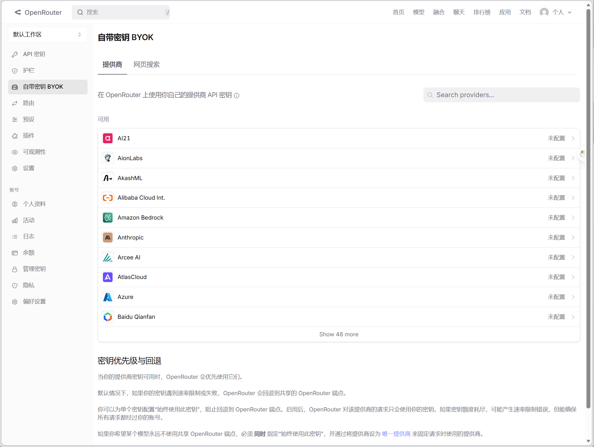
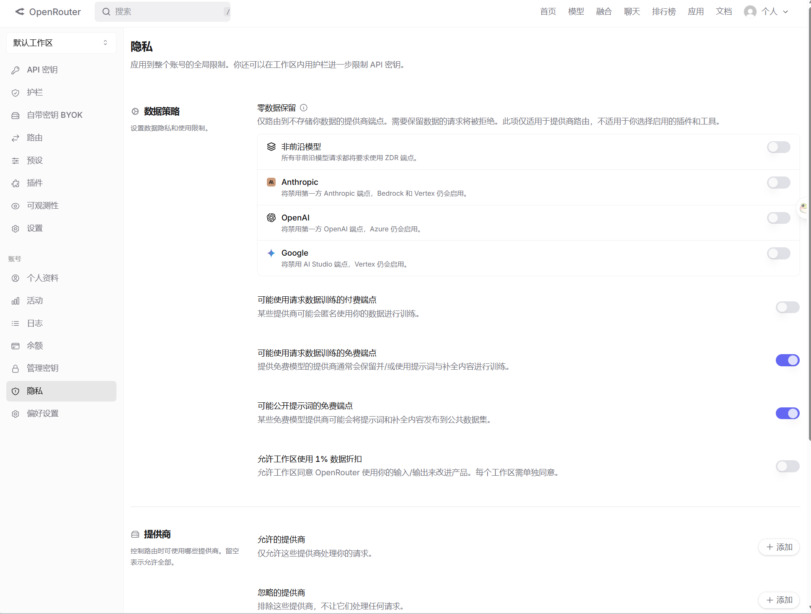
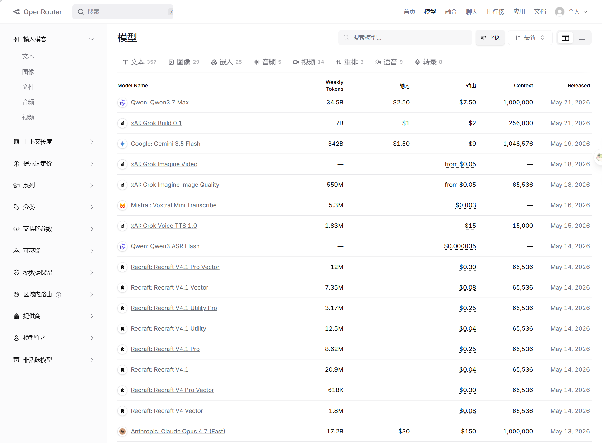
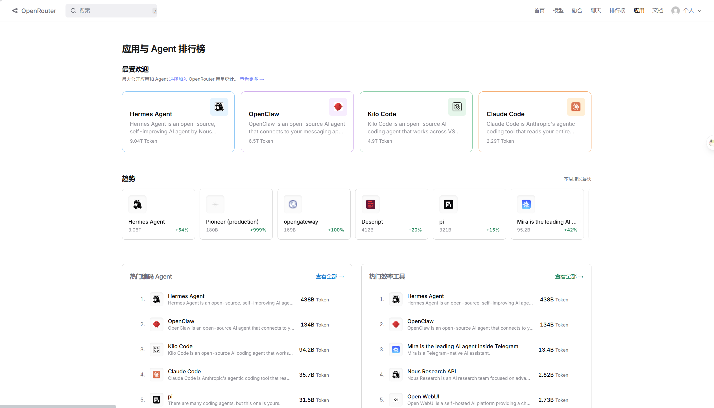
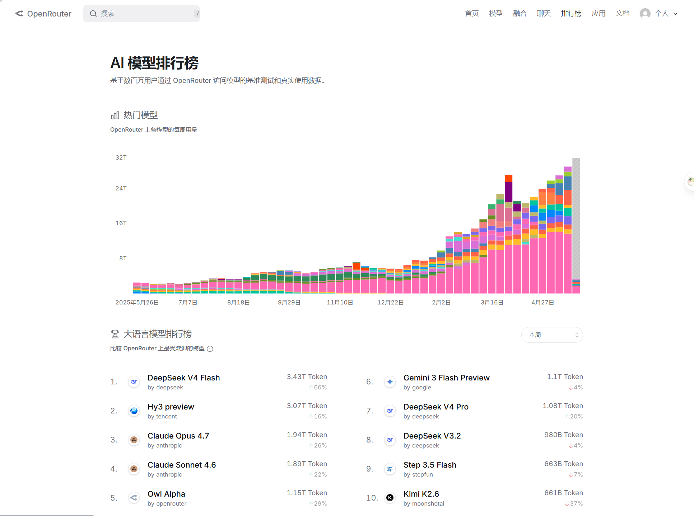

<!-- badges -->
[](LICENSE)
[](https://www.tampermonkey.net/)

# OpenRouter 中文化插件

在浏览器端将 OpenRouter 首页、工作区、排行榜、模型、聊天和账号设置等页面的常见界面文案翻译为简体中文。

[安装正式版](https://github.com/isdoge/openrouter-chinese/releases/download/v1.0.0/openrouter-chinese.user.js)
｜
[问题反馈](https://github.com/isdoge/openrouter-chinese/issues)
｜
[词典与更新说明](docs/DICTIONARY.md)

> **v1.0.0 已正式发布并合入 `main`。** 推荐通过 [Release](https://github.com/isdoge/openrouter-chinese/releases/tag/v1.0.0) 或下方固定的 `v1.0.0` 地址安装；`main` 的脚本升级链与在线词典入口也已提供本次正式版本。

## 功能

- 翻译首页、工作区、排行榜、模型、聊天、Fusion、Labs、Apps 等页面的常见文案，覆盖按钮、表格、输入框占位、下拉菜单、提示浮层和模态框。
- **内置完整的 1731 条发布词典**，首次运行没有缓存、无法连接词典源时也能翻译；无需先下载在线词典才能使用。
- 支持词典缓存和多源在线更新：优先使用较新缓存，在线来源失败时依次尝试备用源，不因更新失败中断翻译。
- 启动时检查自动更新，并每 10 分钟检查更新门槛；成功后冷却 24 小时，失败后冷却 10 分钟，并非每 10 分钟都下载词典。
- 提供启用／停用自动更新、立即更新、查看状态和导入 JSON 菜单；手动强制更新可绕过自动更新冷却。
- 兼容 React 动态渲染：路由切换、弹层打开和异步内容加载后自动重翻译，避免误翻模型 ID、URL、邮箱和 API Key 等内容。
- 补齐 Security、排行榜主榜及子页、Apps 与 Ori 页面相关文案；`Token` / `tokens` 保持英文，不翻译为“令牌”。

内置“完整词典”指本次发布的全部 1731 条词条，不代表 OpenRouter 的所有页面或未来文案都已翻译。离线兜底指翻译词典不依赖网络，并不让 OpenRouter 网站变成离线应用。

## 安全与边界

- 不是 OpenRouter 官方项目，也不是浏览器扩展商店插件；需要 Tampermonkey 等用户脚本管理器。
- 仅处理页面显示文案，词典更新只下载静态 JSON；**不调用 OpenRouter API，不读取 cookie，不收集或上传 API Key、token、账号信息或页面内容，不修改账号真实数据**。
- JSON 只作为词典数据解析，不执行其中的代码。
- 网站文案与结构变化后可能仍有英文残留，欢迎反馈。

## 本地与在线有什么区别

| 选择 | 词典与更新方式 | 适用场景 |
| --- | --- | --- |
| **默认正式版 1.0.0** | 内置完整词典＋缓存＋多源在线更新；可关闭自动更新，也可手动更新或导入 JSON | 推荐给新用户，兼顾首次运行兜底与后续补词 |
| **纯本地备用版 0.1.11**（`legacy/`） | 使用同一源词典生成的完整快照，`@grant none`；翻译运行时不联网更新词典，也没有在线更新管理菜单 | 希望保持纯本地运行，或作为备用方案 |
| **旧在线安装链兼容入口**（`dist/openrouter-chinese-remote.user.js`） | 与默认正式版使用同一引擎和发布词典，保留旧在线版的 namespace 与缓存身份 | 原在线版用户沿原安装链升级，不是另一个“在线版”产品 |

默认正式版的显示名统一为 **OpenRouter 中文化插件**，不加“在线版”或“试验版”后缀。旧在线兼容入口显示名也不加后缀，但不同 namespace 之间不承诺自动共享缓存。

主版与纯本地备用版二选一。备用版沿用原本地版的显示名与 namespace；切换前请先停用原脚本。若管理器允许多个入口并存，也不要同时启用，以免重复处理页面。

后续迭代将继续围绕词条补充、页面适配和更新稳定性展开。正式脚本版本记录功能／引擎变更，词典通过独立 `revision` 迭代；每次词典更新也要独立递增纯本地备用版的 `legacyVersion`，本次为 `0.1.11`。旧版保留备用，不作为新用户的默认安装推荐；未来开发不视为本次已完成的能力。

## 截图

| 首页 | 工作区 |
| --- | --- |
|  |  |

| 设置 | 模型 |
| --- | --- |
|  |  |

| 应用 | 排行榜 |
| --- | --- |
|  |  |

## 安装

### 1. 安装 Tampermonkey

- Chrome / Edge：[Chrome Web Store](https://chromewebstore.google.com/search/tampermonkey)
- 官网：[tampermonkey.net](https://www.tampermonkey.net/)

### 2. 安装正式脚本

本次主安装入口为已发布的 GitHub `v1.0.0` Release 资产：

[安装 OpenRouter 中文化插件 1.0.0](https://github.com/isdoge/openrouter-chinese/releases/download/v1.0.0/openrouter-chinese.user.js)

固定标签备用入口提供相同的正式脚本：

- [GitHub raw](https://raw.githubusercontent.com/isdoge/openrouter-chinese/v1.0.0/dist/openrouter-chinese.user.js)
- [jsDelivr 镜像](https://cdn.jsdelivr.net/gh/isdoge/openrouter-chinese@v1.0.0/dist/openrouter-chinese.user.js)：GitHub 无法访问时可尝试，镜像也不保证所有地区可达。

打开上述已发布地址，按 Tampermonkey 提示确认安装；若下载为文件，可将该文件导入管理器。本项目尚未在 GreasyFork 发布。

#### 应该下载哪个文件？

| 文件／入口 | 用途 |
| --- | --- |
| Release 的 `openrouter-chinese.user.js` | 默认正式版，新用户优先安装这一份 |
| Release 的 `openrouter-chinese-remote.user.js` | 原在线版用户沿旧 namespace 升级的兼容入口，不是另一款产品 |
| Release 的 `zh-CN.online.json` | 词典数据，只用于“导入 JSON”，不是可安装脚本 |
| 固定标签的 `legacy/openrouter-chinese.user.js` | 纯本地备用版 0.1.11；当前不作为 Release 附件提供 |

原在线版用户可使用 [Release 的兼容入口](https://github.com/isdoge/openrouter-chinese/releases/download/v1.0.0/openrouter-chinese-remote.user.js)，或[固定标签的兼容入口](https://raw.githubusercontent.com/isdoge/openrouter-chinese/v1.0.0/dist/openrouter-chinese-remote.user.js)。

纯本地备用版可通过 [GitHub raw](https://raw.githubusercontent.com/isdoge/openrouter-chinese/v1.0.0/legacy/openrouter-chinese.user.js) 或 [jsDelivr](https://cdn.jsdelivr.net/gh/isdoge/openrouter-chinese@v1.0.0/legacy/openrouter-chinese.user.js) 获取；安装与切换见 [legacy 说明](legacy/README.md)。**正式版、备用版与兼容入口只选一份启用。**

### 3. 刷新 OpenRouter 页面

打开或刷新 `https://openrouter.ai/` 下的目标页面即可使用。首次运行即使用内置完整词典；在线词典不可达不影响这份兜底词典。

通过 Tampermonkey 的脚本菜单可停用自动词典更新、立即更新、查看状态或导入 JSON。手动导入只接受带 `schemaVersion`／`revision`／`entries`／`dictionary` 的在线 envelope，可使用生成的 `locales/zh-CN.online.json`；不要直接导入源词典 `zh-CN.json`。来源顺序、缓存优先级及冷却规则见[词典文档](docs/DICTIONARY.md)。

### 脚本升级与词典更新是两件事

- **脚本升级**由用户脚本管理器执行。主版的 `@updateURL`／`@downloadURL` 使用 `main/dist/openrouter-chinese.user.js` 更新链，目前已提供正式版 1.0.0，后续脚本升级也沿此入口发布。首次安装推荐使用上面的固定 `v1.0.0` 安装入口。
- **词典更新**由正式脚本下载静态 JSON，不必为了每次补词重新安装脚本；关闭自动更新后，内置词典与已有可用缓存仍可翻译。
- 固定标签安装地址固定的是这次安装文件，不意味着正式版的后续在线词典也锁定在该标签；词典源仍先尝试 `main`，再使用发布快照兜底。

## 目录

```text
├── src/
│   └── openrouter-chinese.user.js            # 唯一共享引擎模板
├── locales/
│   ├── zh-CN.json                            # 唯一源词典：plain object
│   └── zh-CN.online.json                     # 构建生成的在线 envelope
├── release.config.json                      # revision / legacyVersion / 词典指纹
├── scripts/
│   ├── build.mjs                            # 生成所有脚本与在线词典
│   └── check.mjs                            # 仓库校验入口
├── dist/
│   ├── openrouter-chinese.user.js            # 默认正式版安装产物
│   └── openrouter-chinese-remote.user.js     # 旧在线安装链兼容入口
├── legacy/
│   ├── openrouter-chinese.user.js            # 当前纯本地备用版生成产物
│   ├── archive/                             # 0.1.10 原版、旧在线 beta.5 历史存档
│   └── README.md
├── docs/
│   └── DICTIONARY.md                        # 词典格式、更新与维护合同
├── CHANGELOG.md
├── PUBLISHING.md
├── LICENSE
└── package.json                             # 正式脚本版本
```

`legacy/archive/` 只用于历史保留，不是推荐安装入口。生成产物不要手工维护。

## 开发与贡献

```sh
npm run dictionary:bump  # 仅词典实际变化时显式运行：递增 revision / legacyVersion，更新指纹
npm run build            # 生成正式版、兼容入口、纯本地备用版及在线词典
npm test                 # 执行仓库校验
```

词典未变化时跳过 `dictionary:bump`；`build` 本身不改版本或 revision，词典变化却未迭代配置时应报错。

欢迎提 Issue 或 PR。补翻译建议按以下顺序：

1. 确认英文残留的页面位置与文案；反馈中不要包含账号信息、余额、API Key、cookie 或 token。
2. 在 **`locales/zh-CN.json`** 中补充或修正词条，不再把词典写进 `src/`；运行时行为修改才进入唯一引擎模板。
3. 修改词典后显式运行 `npm run dictionary:bump`，递增 `dictionaryRevision`、递增 `legacyVersion` 的补丁版本并更新 `dictionarySha256`，按[词典维护合同](docs/DICTIONARY.md#词典维护流程)重新构建与校验。
4. 核对生成产物一致，再提交不含私密信息的 PR。真实浏览器验收报告不得进入公开仓库、PR 或 Release。

发布步骤与完整离线首装、缓存、故障回退等验收要求见 [PUBLISHING.md](PUBLISHING.md)。

## 许可

[MIT](LICENSE)

## 致谢

本项目由 [Codex](https://github.com/openai/codex) 辅助完成翻译词典编写、运行时逻辑和构建脚本。
